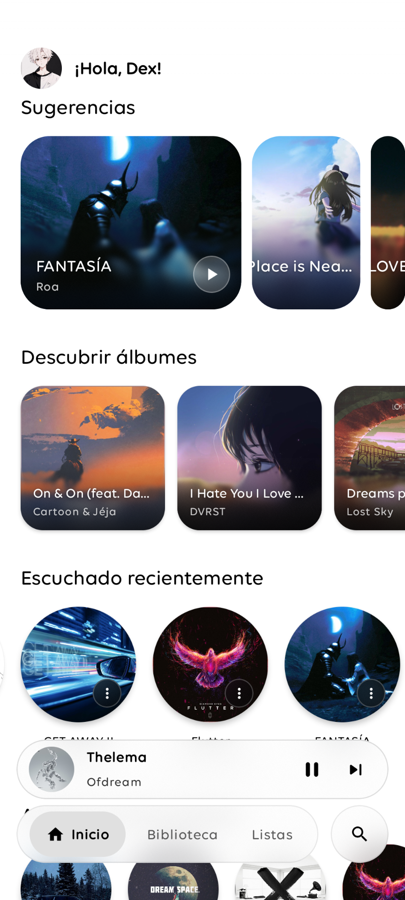
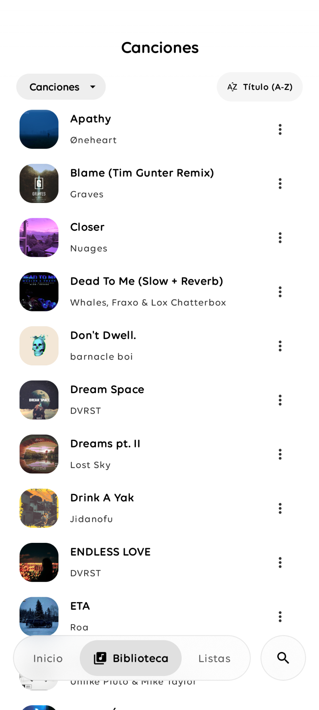
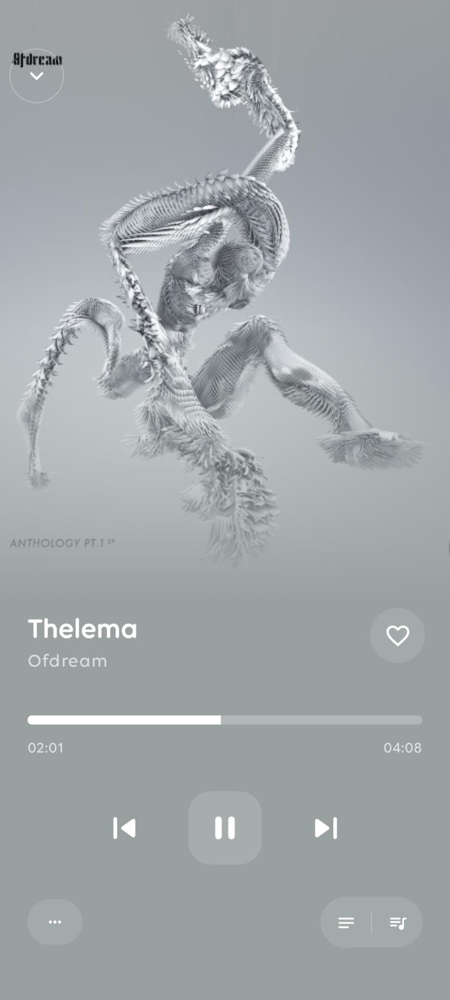
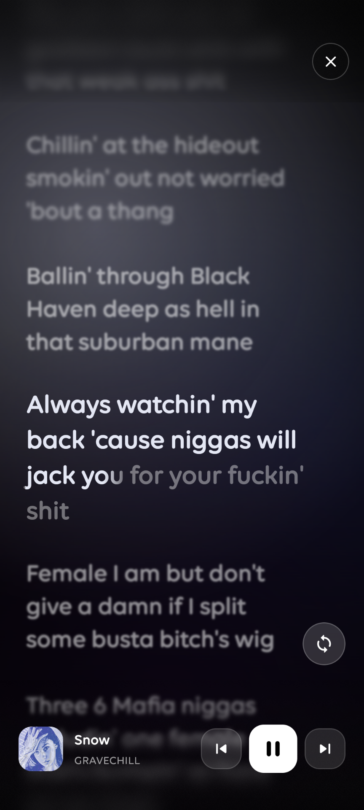

## Dex Player

  

<h3 align="center">A minimal and expressive music player for Android.</h3>

  Built with Kotlin and Jetpack Compose.

  <a href="#features">Features</a> •
  <a href="#screenshots">Screenshots</a> •
  <a href="#technology">Technology</a> •
  <a href="#roadmap">Roadmap</a>

---

## About

Dex Player is a modern local music player for Android, designed around simplicity, personalization and a clean listening experience.

The application combines Material 3 Expressive, adaptive colors and a minimalist interface while keeping the focus on your music.

Dex Player is primarily designed for local music playback, providing tools to browse your library, create playlists and enjoy lyrics both online and offline.

«Designed on a phone. Built from scratch.»

---

## Features

## Music Library

Manage and explore the music stored on your device.

- Local music discovery
- Artists
- Albums
- Songs
- Album artwork
- Library organization

## Music Player

A simple player focused on the listening experience.

- Play / Pause
- Previous / Next
- Queue management
- Background playback
- Media controls
- Album artwork

## Lyrics

Lyrics can be accessed both online and offline.

- Online lyrics
- Offline lyrics
- Local lyrics support

## Playlists

Create and manage your own music collections.

- Create playlists
- Add and remove tracks
- Playlist playback
- Custom music collections

## Interface

Dex Player follows a minimalist and expressive design language.

- Material 3 Expressive
- Adaptive colors
- Dynamic UI elements
- Dark mode
- Smooth animations
- Minimalist interface

---

## Screenshots

  
  
  
  

«Screenshots are subject to change while Dex Player is under development.»

---

## Technology

Dex Player is built using modern Android development technologies.

Technology| Purpose
Kotlin| Main programming language
Jetpack Compose| User interface
Material 3 Expressive| Design system
AndroidX| Android components
MediaStore| Local music discovery
Android Media APIs| Audio playback

---

## Design

Dex Player is built around three main ideas:

Minimal

The interface avoids unnecessary elements and keeps the focus on the music.

Expressive

Material 3 Expressive provides the foundation for the application's components, motion and visual language.

Adaptive

Colors and visual elements adapt to create a more personalized experience across different devices.

---

## Development

Dex Player was designed and developed entirely from a mobile device.

The project is an experiment in mobile-first Android development, using Kotlin and Jetpack Compose without relying on a traditional desktop development environment for the core development workflow.

From the initial interface concepts to implementation and testing, Dex Player was created with a mobile development workflow.

«Designed on a phone. Built from scratch.»

---

## Roadmap

Dex Player is currently under active development.

Completed

- [x] Local music playback
- [x] Music library
- [x] Playlists
- [x] Online lyrics
- [x] Offline lyrics
- [x] Adaptive colors
- [x] Material 3 interface
- [x] Background playback
- [x] Album artwork

## Planned

- [ ] Improved playlist management
- [ ] Better lyrics synchronization
- [ ] Library search
- [ ] Advanced library filters
- [ ] More customization options
- [ ] Settings
- [ ] Additional Material 3 Expressive components
- [ ] Performance improvements

---

## Project Status

«Dex Player is currently in development.»

The application is continuously evolving, so features, design elements and internal architecture may change during development.

---

## License

Dex Player is closed-source software.

The source code, assets, designs and other original content contained in this repository are proprietary to the author.

You may not:

- Copy the source code
- Modify or redistribute the project
- Republish the application or its assets
- Use the source code in another project
- Sell or commercially distribute any part of the project

without explicit permission from the author.

All rights reserved.

© 2026 Dex

---

## Developer

  <strong>Dex</strong>
   
  <a href="https://github.com/dexvoid-git">@dexvoid-git</a>

---

  Made with Kotlin & Jetpack Compose.
    
  <i>Designed on a phone. Built from scratch.</i>

