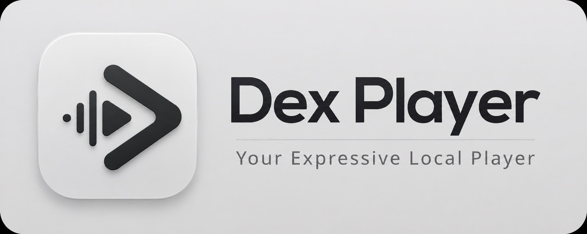

  

<h1 align="center">Dex Player</h1>

  A minimal and expressive local music player for Android.

  Built with Kotlin and Jetpack Compose.

  <a href="#about">About</a> ·
  <a href="#features">Features</a> ·
  <a href="#screenshots">Screenshots</a> ·
  <a href="#technology">Technology</a> ·
  <a href="#roadmap">Roadmap</a>

 

  <strong>ABOUT</strong>

---

Dex Player is a modern local music player for Android focused on simplicity, personalization and a clean listening experience.

The application combines **Material 3 Expressive**, adaptive colors and a minimalist interface designed around the user's local music library.

Dex Player is built primarily for local music playback, while providing additional features such as lyrics, playlists, library management and background playback.

 

  <strong>FEATURES</strong>

---

### Music Library

Browse and manage music stored locally on your device.

- Local music discovery
- Artists
- Albums
- Songs
- Album artwork
- Library organization

### Player

A simple playback experience focused on the music.

- Play / Pause
- Previous / Next track
- Queue management
- Background playback
- Media controls
- Album artwork

### Lyrics

Lyrics can be accessed both online and offline.

- Online lyrics
- Offline lyrics
- Local lyrics support

### Playlists

Create and manage your own music collections.

- Create playlists
- Add and remove tracks
- Playlist playback
- Custom music collections

### Interface

A clean interface built around Material 3 Expressive.

- Material 3 Expressive
- Adaptive colors
- Minimalist design
- Dynamic visual elements
- Dark mode
- Smooth animations

 

  <strong>SCREENSHOTS</strong>

---

  
  
  
  

 

  <strong>TECHNOLOGY</strong>

---

| Technology | Purpose |
| :--- | :--- |
| **Kotlin** | Main programming language |
| **Jetpack Compose** | User interface |
| **Material 3 Expressive** | Design system |
| **AndroidX** | Android components |
| **MediaStore** | Local music discovery |
| **Android Media APIs** | Audio playback |

 

  <strong>DESIGN</strong>

---

Dex Player follows three main design principles:

**Minimal**

The interface avoids unnecessary elements and keeps the focus on the music.

**Expressive**

Material 3 Expressive provides the foundation for the application's components, motion and visual language.

**Adaptive**

Colors and visual elements adapt to create a more personalized experience across different devices.

 

  <strong>DEVELOPMENT</strong>

---

Dex Player was designed and developed entirely from a **mobile device**.

The project is an experiment in mobile-first Android development, using Kotlin and Jetpack Compose without relying on a traditional desktop development environment for the core development workflow.

From interface design and implementation to testing, Dex Player was created using a mobile development workflow.

> **Designed on a phone. Built from scratch.**

 

  <strong>ROADMAP</strong>

---

### Completed

- [x] Local music playback
- [x] Music library
- [x] Playlists
- [x] Online lyrics
- [x] Offline lyrics
- [x] Adaptive colors
- [x] Material 3 interface
- [x] Background playback
- [x] Album artwork

### Planned

- [ ] Improved playlist management
- [ ] Better lyrics synchronization
- [ ] Library search
- [ ] Advanced library filters
- [ ] More customization options
- [ ] Settings
- [ ] Additional Material 3 Expressive components
- [ ] Performance improvements

 

  <strong>PROJECT STATUS</strong>

---

Dex Player is currently under active development.

Features, UI elements and internal architecture may change as development continues.

 

  <strong>LICENSE</strong>

---

Dex Player is **closed-source software**.

The source code, assets, designs and other original content contained in this repository are proprietary to the author.

You may not copy, modify, redistribute, republish, sell or use any part of the project in another project without explicit permission from the author.

**All rights reserved.**

© 2026 Dex

 

  <strong>DEVELOPER</strong>

---

  <strong>Dex</strong>
   
  <a href="https://github.com/dexvoid-git">@dexvoid-git</a>

 

  Made with Kotlin and Jetpack Compose.
   
   
  <i>Designed on a phone. Built from scratch.</i>

